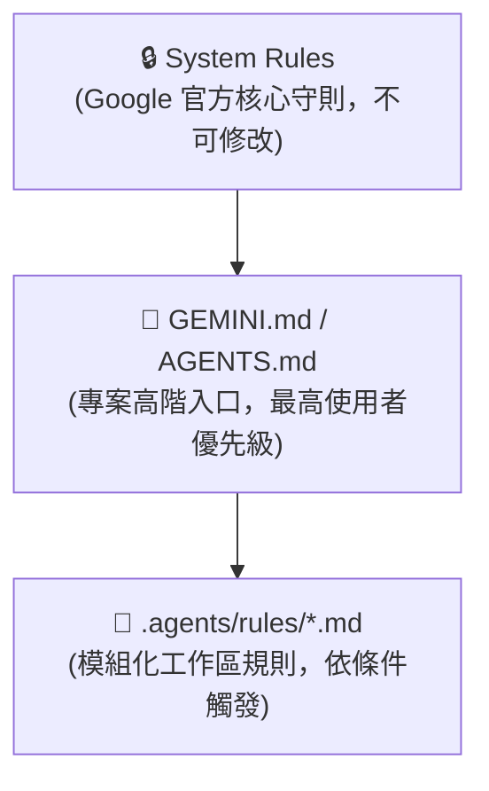
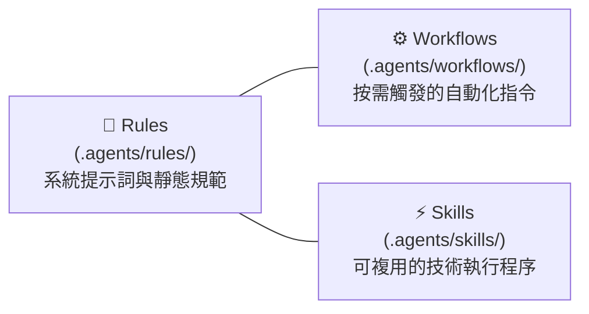

# Google Antigravity AI 助手配置與規則系統完全指南
## 工作區規則、模組化觸發器與行為架構詳解

> 本指南專為 **Google Antigravity IDE** 開發者與專案維護者設計，詳細解析 Antigravity 核心的規則（Rules）載入機制、YAML 觸發器、工作流配置，以及如何透過模組化設計極大化提升 AI 助手的專案感知效能。

---

## 一、Antigravity 規則載入架構 (Hierarchical Configuration Model)

在 Google Antigravity 中，AI 助手在進入工作區並處理您的請求時，會自動組合並解析一連串的指令與上下文。其載入與覆寫優先級如下：



### 1.1 核心配置檔案說明

*   **專案高階入口 (`AGENTS.md` / `GEMINI.md`)**：
    *   放置於專案根目錄。
    *   做為 AI 助手進入專案時的「README」，提供高階的專案技術棧介紹、開發環境指令，並索引所有的規則目錄。
    *   若兩者同時存在，`GEMINI.md` 的載入優先級高於 `AGENTS.md`。
*   **模組化工作區規則 (`.agents/rules/` 或 `.agent/rules/`)**：
    *   存放在專案或 Git 根目錄下的規則資料夾。
    *   每個檔案都是帶有 **YAML Frontmatter** 的獨立 Markdown 文件，根據檔案變更或上下文觸發，**是 Antigravity 最核心的效能與行為優化工具**。

---

## 二、Antigravity 模組化規則引擎 (.agents/rules/)

傳統的 AI 輔助開發中，所有的規範（編碼風格、測試政策、安全性限制）都會塞在單一的 `.cursorrules` 或 `.clauderules` 檔案中。這會造成嚴重的 **「上下文污染」** 與 **「Tokens 浪費」**。

Antigravity 透過**模組化規則**與**YAML  Frontmatter 觸發器**解決了這個痛點，讓 AI 助手能「在對的時間載入對的規範」。

### 2.1 規則檔案結構

每個規則檔案（例如 `numba-jit.md`）頂部都必須以 `---` 包裹 YAML frontmatter，定義其觸發條件：

```yaml
---
description: "Numba JIT compilation constraints and standard python exclusions."
trigger: always_on
---

# 您的規則詳細內容...
```

### 2.2 觸發模式 (Trigger Modes) 完全解析

| 觸發模式 | YAML 語法 | 運作機制 | 適用場景 |
|:---|:---|:---|:---|
| **`always_on`** | `trigger: always_on` | 無論操作何種檔案，此規則在每次對話皆會載入。 | 全域工作流程、標準測試政策、基礎技術棧說明。 |
| **`glob`** | `trigger: glob`<br>`glob: "**/*.py"` | 僅當 AI 當前處理或修改的檔案匹配該 pattern 時才載入。 | 針對特定模組（如西洋棋搜尋、資料庫、前端）的深度技術限制。 |
| **`model_decision`** | `trigger: model_decision`<br>`description: "..."` | AI 模型根據當前任務與描述（description）判定相關時載入。 | 偶爾需要的架構重構規範、新 feature 設計原則。 |
| **`manual`** | `trigger: manual` | 預設不載入，僅在對話框中透過 `@mention` 提及時啟用。 | 只有在特定除錯、發布或手動檢驗時才需要的指令。 |

> [!TIP]
> 使用 **`glob` 觸發器** 可以極大地釋放 AI 的上下文空間，避免將無關的規範（例如前端排版規則）載入到後端計算任務中。

---

## 三、Antigravity 自動化架構：Rules vs Workflows vs Skills

除了持久的規則之外，Antigravity 還提供了解決不同情境的自動化工具：



1.  **Rules（規則）**：
    *   **用途**：定義 AI 的「性格」與「防線」。不具備主動執行的腳本，而是做為約束。
    *   **觸發**：系統自動加載（`always_on` / `glob` 等）。
2.  **Workflows（工作流）**：
    *   **用途**：按需觸發的多步驟、複雜自動化流程（例如「檢查程式碼、跑測試、生成 PR、部署到測試環境」）。
    *   **觸發**：透過斜線指令（`/指令`）在聊天框中調用。
3.  **Skills（技能）**：
    *   **用途**：封裝好的進階操作指南或代碼生成範本。
    *   **觸發**：在對話中透過 `@mention` 引用，AI 將遵循該技能的指示進行程式碼的撰寫。

---

## 四、最佳實踐與防線優化

要在 Antigravity 中調教出最完美、最聽話的 AI 助手，請務必遵循以下實踐：

### 4.1 關注點分離 (Separation of Concerns)
將不同的限制寫在專門的檔案中。例如：
*   `workflow.md` (`always_on`)：要求 AI 「工作前檢索 `README.md` 的導覽索引」、「工作後同步更新技術文檔」。
*   `numba-jit.md` (`always_on`)：要求 AI 必須嚴格遵循編譯相容性，不使用 Class 或動態字典。
*   `board-integrity.md` (`glob: "**/board_operations.py"`)：規範 Make/Unmake 操作的原子性與 XOR 增量更新。

### 4.2 嚴格控制測試與權限
在 `workflow.md` 中，為防範毀滅性命令或非預期的環境修改，應明確寫入：
> 🚫 **嚴禁 AI 自動執行測試或建置命令**：AI 助手不可擅自透過終端機啟動 perft 或單元測試，而必須引導使用者手動執行。

### 4.3 檔案大小限制
*   單個規則 Markdown 檔案應保持高信噪比，避免堆砌廢話。
*   每個規則檔案大小應在 **12,000 字元**內，確保 AI 讀取速度與精準度。

---

## 五、實戰藍圖：Chess Numba 專案配置

以下是本專案的完整規則結構藍圖，展現了 Antigravity 極致的模組化管理：

```
chess_numba/
├── AGENTS.md                          # 專案高階引導（入口）
├── README.md                          # 人類閱讀的說明書
└── .agents/
    └── rules/
        ├── workflow.md                # [always_on] 文件維護流程與手動測試政策
        ├── numba-jit.md               # [always_on] 靜態編譯相容性約束
        ├── board-integrity.md         # [glob: **/board_operations.py] Make/Unmake 與 Zobrist Invariants
        ├── search-constraints.md      # [glob: **/search.py] Negamax 與重複和局限制
        └── nnue-specification.md      # [glob: **/nnue/**/*.py] 針對 custom NNUE 的架構偏離警告
```

當 AI 助手修改 `nnue/core.py` 時，Antigravity 的規則加載行為會自動最佳化：
*   **載入**：`workflow.md` (Always-on) + `numba-jit.md` (Always-on) + `nnue-specification.md` (Glob 觸發)
*   **不載入**：`board-integrity.md` (無關) + `search-constraints.md` (無關)
*   **結果**：AI 助手獲得了最精準的 NNUE 架構偏離警示，且沒有被搜尋引擎的 Negamax 規則佔用額外的記憶體窗口！

---

## 六、參考文獻與資源

*   **Google Antigravity 官方技術手冊**：[https://antigravity.google](https://antigravity.google)
*   **Antigravity 規則引擎與配置規格書 (YAML Frontmatter)**：[https://antigravity.codes](https://antigravity.codes)
*   **Agents.md 開源標準組織**：[https://agents.md/](https://agents.md/)（現由 Linux Foundation 旗下 Agentic AI Foundation 託管）
*   **Gemini CLI 設定檔與環境整合**：[https://github.com/google-gemini/gemini-cli/blob/main/docs/get-started/configuration.md](https://github.com/google-gemini/gemini-cli/blob/main/docs/get-started/configuration.md)
