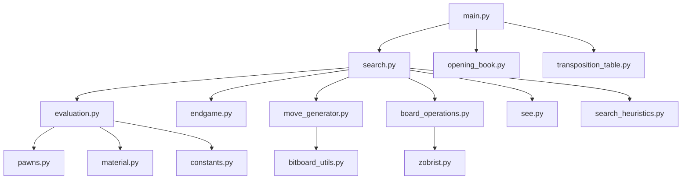

# 西洋棋引擎架構說明文件

本文件說明本倉庫引擎核心的模組分工與關聯。語言為 **Python**，核心熱路徑以 **Numba JIT** 編譯，棋盤以 **位元棋盤 (Bitboards)** 表示。

完整文件索引見專案根目錄 [README.md](../README.md) 的「專案文件導覽」。

---

## 1. 套件三分法

| 目錄 | 進入點 | 角色 |
| :--- | :--- | :--- |
| `classical/` | `main.py`、`assistant.py` | **現行** 手工評估 (HCE) + 搜尋 |
| `classical_old/` | `main_old.py` | **對戰基準快照**；僅 `.py` 由 `tools/sync_classical_old.py` 同步，**不維護 markdown** |
| `nnue/` | `main_nn.py`、`assistant_nn.py` | NNUE 評估 + 共用搜尋架構變體；`ml_eval/` 負責訓練與量化 |

共享資源：`chess_engine/polyglot.bin`（開局書）。

---

## 2. 分層架構

1. **介面層 (UCI)**：解析 GUI 命令（`uci` / `position` / `go` 等）。
2. **搜尋層 (Search)**：迭代加深、PVS、剪枝、靜態搜尋。
3. **評估層 (Evaluation)**：Classical HCE 或 NNUE 前向。
4. **移動生成層 (Move Generation)**：偽合法 / 合法著法、Magic Bitboards。
5. **棋盤表示層 (Board)**：`make_move` / `unmake_move`、Zobrist、FEN。

---

## 3. Classical 核心模組

路徑皆相對 `chess_engine/classical/`。

### 3.1 進入點

* **[main.py](../main.py)**：Classical UCI 循環；開局書、置換表、時間管理，`go` 時呼叫搜尋。
* **[main_old.py](../main_old.py)**：同上，但 import `classical_old`（對戰 Old 側）。

### 3.2 搜尋與剪枝

* **[search.py](classical/search.py)**：迭代加深、PVS/Negamax、QS、NMP/LMR/RFP/…、奇異延展等。
* **[search_heuristics.py](classical/search_heuristics.py)**：殺手步、歷史表、吃子/安靜排序、LMR 表。
* **[see.py](classical/see.py)**：靜態交換評估（SEE），用於排序與剪枝。
* **[transposition_table.py](classical/transposition_table.py)**：置換表。
* **[time_manager.py](classical/time_manager.py)**：時限分配。

技術細節見 [SEARCH_ANALYSIS.md](classical/SEARCH_ANALYSIS.md)、[SEE_ANALYSIS.md](classical/SEE_ANALYSIS.md)、[HISTORY_HEURISTICS_CN.md](classical/HISTORY_HEURISTICS_CN.md)。

### 3.3 評估 (HCE)

* **[evaluation.py](classical/evaluation.py)**：主評估入口（材質、機動性、威脅、王安全、initiative、空間等）。
* **[pawns.py](classical/pawns.py)**：兵型結構、兵盾、車線等。
* **[material.py](classical/material.py)**：材質不平衡多項式。
* **[endgame.py](classical/endgame.py)**：專用殘局（KXK / KPK / …）與殘局縮放。
* **[constants.py](classical/constants.py)**：權重、PST、搜尋閾值、歷史上限等。

對齊 Stockfish 11 的現況總表見 [HCE_SF11_GAP_AUDIT.md](classical/HCE_SF11_GAP_AUDIT.md)；殘局驗證見 [ENDGAME_SF_VERIFICATION.md](classical/ENDGAME_SF_VERIFICATION.md)。

### 3.4 移動與棋盤

* **[move_generator.py](classical/move_generator.py)**：攻擊表、偽合法/合法生成、`is_square_attacked`。
* **[board_operations.py](classical/board_operations.py)**：`make_move` / `unmake_move`、增量 Zobrist。
* **[move.py](classical/move.py)**：16-bit 著法編碼。
* **[zobrist.py](classical/zobrist.py)**：Zobrist 鍵。
* **[fen_parser.py](classical/fen_parser.py)**：FEN → 位元棋盤。
* **[bitboard_utils.py](classical/bitboard_utils.py)**：LSB/popcount、射線等。
* **[engine_types.py](classical/engine_types.py)**：Numba 簽名與 `SearchContext`。
* **[opening_book.py](classical/opening_book.py)**：Polyglot 開局書。

---

## 4. NNUE 模組（摘要）

* **[nnue/ARCHITECTURE.md](nnue/ARCHITECTURE.md)**：HalfKAv2_hm、512 累積層、8 分桶 LayerStack、量化推理。
* **[nnue/ml_eval/](nnue/ml_eval/)**：`train.py`、`quantize_weights.py`、`inference.py`、`weights/`。
* 訓練資料管線在 **`tuner/nnue_pipeline/`**（見 [tuner/README.md](../tuner/README.md) 與 [ml_eval 操作說明](nnue/ml_eval/ml_eval_documentation_and_architecture.md)）。

---

## 5. 對戰與測試工具

### 5.1 錦標賽（New vs Old）

* **[tools/tournament.py](../tools/tournament.py)**：多局 UCI 對戰、SPRT、成對換先、可併發。
* 預設：`--engine1 main.py`（New）、`--engine2 main_old.py`（Old）。
* 開局庫：`data/openings.epd`。
* 棋譜輸出：`tournament_analysis/tournament_results.pgn`。
* 操作詳見 [tools/TOURNAMENT_TUTORIAL.md](../tools/TOURNAMENT_TUTORIAL.md)。

```bash
python tools/tournament.py --engine1 main.py --engine2 main_old.py --games 100 --time 1000
```

同步 Old 基準（只複製 `.py` 並改 import）：

```bash
python tools/sync_classical_old.py --diff
# python tools/sync_classical_old.py --sync   # 確認後再執行
```

### 5.2 其他

* **[tools/match_runner.py](../tools/match_runner.py)**：對 Stockfish 等外部引擎；可做 PV 合法性檢查。
* **[tests/benchmark.py](../tests/benchmark.py)**、**[tests/perft.py](../tests/perft.py)**、**[tests/test_puzzle.py](../tests/test_puzzle.py)**、**[tests/test_endgame_conformance.py](../tests/test_endgame_conformance.py)**。

---

## 6. 模組關聯（Classical 路徑）



---

## 7. 搜尋流程簡述

1. `main.py` 收到 `go`，進入 `search.py` 的迭代加深。
2. 每層以 PVS / 零窗口擴展；置換表與歷史啟發改善排序。
3. 節點內生成著法 → `make_move` → 合法性 / 將軍資訊 → 遞迴。
4. 葉節點或深度 0 進入靜態搜尋或評估（HCE 或 NNUE）。
5. 結果寫入置換表；根節點輸出 UCI `bestmove`。
