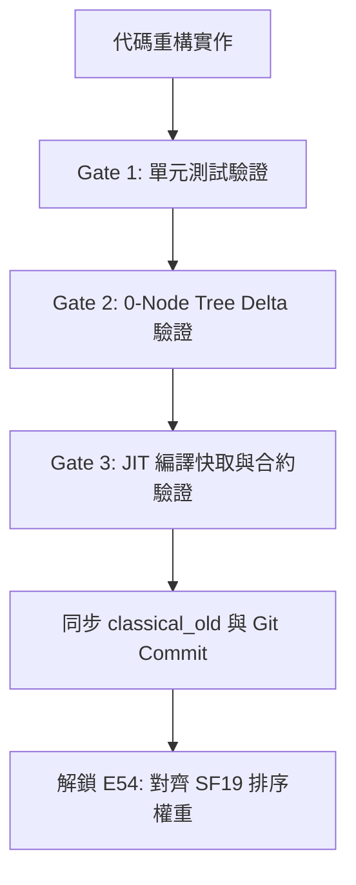

# 走步排序（MovePicker）與歷史剪枝（History Pruning）架構解耦計畫書

| 項目 | 內容 |
| :--- | :--- |
| **目標模組** | `chess_engine/classical/search_heuristics.py`、`constants.py`、`search.py` |
| **性質** | **架構重構（Architectural Decoupling）** · 第一階段保持 **0-Node Tree Delta** |
| **前置基準** | **E53 生產基線**（`PRUNING_CONTINUATION_THRESHOLD = -1500`，Commit `de63dd9`） |
| **參考標準** | `stockfish_repo/` (SF 19: `movepick.cpp` vs `search.cpp`) |
| **完成目標** | 解除 MovePicker 與 History Pruning 的強耦合，為後續平滑化安靜步加權（E54）鋪平道路 |

---

## 一、 問題背景與架構癥結

### 1.1 歷史淵源與現狀

在現行的 Classical 引擎架構中，`chess_engine/classical/search_heuristics.py` 提供了 `get_quiet_stat_score()` 函式。該函式將多種歷史表資訊加權累加為一個綜合分數：

```python
score = search_context.history_table[aggressor_type, to_sq] * HISTORY_WEIGHT_MAIN        # 3
score += search_context.pawn_history[pawn_key_idx, aggressor_type, to_sq] * 2            # 2
score += search_context.butterfly_history[from_sq, to_sq]                                # 1
score += cont1 * HISTORY_WEIGHT_CONT_1                                                   # 5 (含 optional floor)
score += cont2 * HISTORY_WEIGHT_CONT_2                                                   # 2
score += cont3 * HISTORY_WEIGHT_CONT_3                                                   # 1
score += cont4 * HISTORY_WEIGHT_CONT_4                                                   # 2
score += cont6 * HISTORY_WEIGHT_CONT_5                                                   # 1
```

### 1.2 強耦合引發的「不可動」陷阱

此函式在引擎內部同時承擔了兩種截然不同的任務：
1. **走步排序（Move Ordering）**：
   - 在 `search_heuristics.py:score_quiet_moves()` 中，安靜步以此綜合分數加上 Killer/Counter/Threat 決定搜尋順序。
2. **歷史剪枝（History Pruning）**：
   - 在 `search.py:2263`（Step 14b）中，以 `history_score = get_quiet_stat_score(..., HISTORY_PRUNE_CONT1_FLOOR)` 計算綜合分數，並以 `if history_score < PRUNING_HISTORY_THRESHOLD * depth`（`-6500 * depth`）直接剪除走步。

**致命弊端**：
* 若直接微調走步排序權重（例如將過度放大的 `HISTORY_WEIGHT_CONT_1 = 5` 調降至 Stockfish 19 的平滑比例 `1`），剪枝端的 `history_score` 數值會瞬間暴跌 50%~60%。
* 這會導致原本精準調校的 `-6500 * depth` 剪枝門檻完全失效（幾乎永遠無法觸發剪枝），造成搜尋樹體積失控膨脹、全域搜尋深度崩跌，形成「一動就大輸」的假象。

### 1.3 Stockfish 19 的官方解耦範式

經深入查證 `stockfish_repo/`：
* **`movepick.cpp:231-237`（MovePicker 走步排序）**：
  ```cpp
  m.value  = 2 * (*mainHistory)[us][m.raw()];
  m.value += 2 * sharedHistory->pawn_entry(pos)[pc][to];
  m.value += (*continuationHistory[0])[pc][to];  // cont 1-ply
  m.value += (*continuationHistory[1])[pc][to];  // cont 2-ply
  m.value += (*continuationHistory[2])[pc][to];  // cont 3-ply
  m.value += (*continuationHistory[3])[pc][to];  // cont 4-ply
  m.value += (*continuationHistory[5])[pc][to];  // cont 6-ply
  ```
  比例極其平滑（2 : 2 : 1 : 1 : 1 : 1 : 1），無任何極端放大係數。
* **`search.cpp:1200-1206`（搜尋歷史剪枝）**：
  ```cpp
  int history = (*contHist[0])[pc][to] + (*contHist[1])[pc][to] + pawn_entry[pc][to];
  if (history < -4136 * depth)
      continue;
  ```
  剪枝只採用最純粹的未加權延續歷史與兵歷史，與 MovePicker 的排序綜合分數**徹底解耦**。

---

## 二、 重構目標與成功準則

1. **職責明確分離**：
   - 走步排序專用函式：`get_quiet_ordering_score(...)`，依賴獨立的排序權重常數。
   - 歷史剪枝專用函式：`get_quiet_stat_score(...)`（或 `get_history_prune_score(...)`），維持現行剪枝常數與門檻。
2. **第一階段零搜尋樹差分（0-Node Tree Delta）**：
   - 在解耦初始配置下，新舊程式碼對所有局面（包含 Kiwipete 與起手式）在固定深度下走步順序、擴展節點數精確到個位數 **100% 絕對一致**。
3. **合約與單元測試 100% PASS**：
   - 保留現有測試相容性（`tests/test_history.py`、`tests/test_search_core_contracts.py` 等）。
4. **Numba JIT 安全性**：
   - 嚴格遵守 `.agents/rules/numba-jit.md`：無 dynamic type、純 NumPy/整數運算、`cache=True`、無全域陣列特化。

---

## 三、 重構實作設計

### 3.1 常數分層（`chess_engine/classical/constants.py`）

保留既有剪枝常數，新增專用走步排序常數：

```python
# =====================================================================
# 1. 走步排序專用歷史權重 (MovePicker Ordering Weights)
# =====================================================================
# 初始設定：鏡像現行數值以達成 Phase 1 零差分；解耦後供 E54 獨立對齊 SF19。
ORDERING_WEIGHT_MAIN = 3
ORDERING_WEIGHT_PAWN = 2
ORDERING_WEIGHT_BUTTERFLY = 1
ORDERING_WEIGHT_CONT_1 = 5
ORDERING_WEIGHT_CONT_2 = 2
ORDERING_WEIGHT_CONT_3 = 1
ORDERING_WEIGHT_CONT_4 = 2
ORDERING_WEIGHT_CONT_5 = 1

# =====================================================================
# 2. 搜尋剪枝專用歷史權重 (Search Pruning Weights) - 維持既有基線
# =====================================================================
HISTORY_WEIGHT_MAIN = 3
HISTORY_WEIGHT_CONT_1 = 5
HISTORY_WEIGHT_CONT_2 = 2
HISTORY_WEIGHT_CONT_3 = 1
HISTORY_WEIGHT_CONT_4 = 2
HISTORY_WEIGHT_CONT_5 = 1
HISTORY_PRUNE_CONT1_FLOOR = -4096
PRUNING_HISTORY_THRESHOLD = -6500
PRUNING_CONTINUATION_THRESHOLD = -1500
```

### 3.2 排序打分函式實作（`chess_engine/classical/search_heuristics.py`）

新增專屬於走步排序的輕量、高效 JIT 函式：

```python
@numba.njit(cache=True, boundscheck=False, fastmath=True)
def get_quiet_ordering_score(
    search_context, ply, from_sq, to_sq, aggressor_type, pawn_key_idx
):
    score = search_context.history_table[aggressor_type, to_sq] * ORDERING_WEIGHT_MAIN
    score += search_context.pawn_history[pawn_key_idx, aggressor_type, to_sq] * ORDERING_WEIGHT_PAWN
    score += search_context.butterfly_history[from_sq, to_sq] * ORDERING_WEIGHT_BUTTERFLY

    if ply > 0:
        prev_move = search_context.move_stack[ply - 1]
        prev_piece = search_context.piece_stack[ply - 1]
        if prev_move != NO_MOVE and prev_piece != -1:
            score += search_context.continuation_history[
                0, prev_piece, get_to_square(prev_move), aggressor_type, to_sq
            ] * ORDERING_WEIGHT_CONT_1

    if ply > 1:
        prev_move = search_context.move_stack[ply - 2]
        prev_piece = search_context.piece_stack[ply - 2]
        if prev_move != NO_MOVE and prev_piece != -1:
            score += search_context.continuation_history[
                1, prev_piece, get_to_square(prev_move), aggressor_type, to_sq
            ] * ORDERING_WEIGHT_CONT_2

    if ply > 2:
        prev_move = search_context.move_stack[ply - 3]
        prev_piece = search_context.piece_stack[ply - 3]
        if prev_move != NO_MOVE and prev_piece != -1:
            score += search_context.continuation_history[
                2, prev_piece, get_to_square(prev_move), aggressor_type, to_sq
            ] * ORDERING_WEIGHT_CONT_3

    if ply > 3:
        prev_move = search_context.move_stack[ply - 4]
        prev_piece = search_context.piece_stack[ply - 4]
        if prev_move != NO_MOVE and prev_piece != -1:
            score += search_context.continuation_history[
                3, prev_piece, get_to_square(prev_move), aggressor_type, to_sq
            ] * ORDERING_WEIGHT_CONT_4

    if ply > 5:
        prev_move = search_context.move_stack[ply - 6]
        prev_piece = search_context.piece_stack[ply - 6]
        if prev_move != NO_MOVE and prev_piece != -1:
            score += search_context.continuation_history[
                4, prev_piece, get_to_square(prev_move), aggressor_type, to_sq
            ] * ORDERING_WEIGHT_CONT_5

    return score
```

### 3.3 呼叫端分流

* **`score_quiet_moves`（Line 476）**：
  改為呼叫 `get_quiet_ordering_score(...)`。
* **`search.py:2263`（歷史剪枝）**：
  維持呼叫 `get_quiet_stat_score(..., HISTORY_PRUNE_CONT1_FLOOR)`，確保 Step 14b 剪枝不受任何走步排序調整的波及。
* **`score_evasions`（Line 343）**：
  保留 `base_score = get_quiet_stat_score(...)` 或改為 ordering score，並維持合約測試一致。

---

## 四、 驗證步驟與驗收標準（Verification Gates）



1. **Gate 1：單元測試**
   - 執行 `python -m unittest tests/test_history.py tests/test_search_core_contracts.py tests/test_sync_classical_old.py`。
   - 所有測試必須 100% 通過。
2. **Gate 2：0-Node Tree 等價性驗證**
   - 建立驗證腳本：針對 Kiwipete 局面（depth 14）與起始局面，比對重構前（`classical_old`）與重構後（`classical`）的節點數與 PV 走法。
   - **必須滿足**：節點數個位數 100% 相同（Delta = 0）。
3. **Gate 3：JIT 快取與效能確認**
   - 確認 JIT cache 正常命中，未產生動態型別警告。

---

## 五、 後續推進（E54 提案展望）

在架構解耦通過並完成驗收後，即可放心啟動 **E54**：
* 將 `ORDERING_WEIGHT_*` 正式調整為 Stockfish 19 標準：
  - `ORDERING_WEIGHT_MAIN`: 3 -> **2**
  - `ORDERING_WEIGHT_PAWN`: 2 -> **2**
  - `ORDERING_WEIGHT_BUTTERFLY`: 1 -> **0 或 1**
  - `ORDERING_WEIGHT_CONT_1`: 5 -> **1**
  - `ORDERING_WEIGHT_CONT_2`: 2 -> **1**
  - `ORDERING_WEIGHT_CONT_3`: 1 -> **1**
  - `ORDERING_WEIGHT_CONT_4`: 2 -> **1**
  - `ORDERING_WEIGHT_CONT_5`: 1 -> **1**
* 執行 400 場 × 300,000 nodes 對戰，驗證走步排序平滑化對 Elo 的純淨增益！
