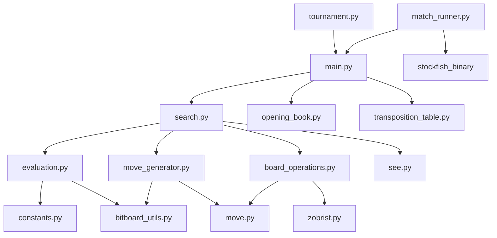

# 西洋棋引擎架構說明文檔 (engine.md)

本文件詳細介紹了本西洋棋引擎的各個組件、檔案功能以及它們之間的相互關聯。本引擎採用 **Python** 編寫，並利用 **Numba** 進行即時編譯 (JIT) 加速，核心數據結構基於 **位元棋盤 (Bitboards)**。

---

## 1. 專案整體架構

引擎遵循典型的西洋棋引擎設計架構，主要分為以下幾個層次：
1.  **介面層 (UCI)**：負責與外部 GUI 通訊。
2.  **搜尋層 (Search)**：驅動博弈樹搜尋與剪枝。
3.  **評估層 (Evaluation)**：對靜態局面進行評分。
4.  **移動生成層 (Move Generation)**：計算合法移動。
5.  **棋盤表示層 (Board Representation)**：維護棋盤狀態、處理移動（Make/Unmake）。

---

## 2. 核心檔案與功能說明

### 2.1 進入點與通訊
*   **[[main.py]]**
    *   **功能**：引擎的主進入點。實現了 **UCI 協議** 循環，解析來自 GUI 的命令（如 `uci`, `isready`, `position`, `go`）。
    *   **關鍵邏輯**：管理搜尋線程，初始化 [[opening_book.py|開局書]] 和 [[transposition_table.py|置換表]]。當收到 `go` 命令時，會調用 [[search.py|搜尋模組]]。

### 2.2 搜尋與剪枝 ([[search.py]])
*   **功能**：引擎的大腦，負責在博弈樹中尋找最佳移動。
*   **核心技術**：
    *   **迭代加深搜尋 (Iterative Deepening)**：逐步增加深度直到時間耗盡。
    *   **主要變例搜尋 (PVS)**：優化 Alpha-Beta 搜尋。
    *   **剪枝技術**：包括 [[see.py|SEE 剪枝]]、空著剪枝 (NMP)、晚期移動歸約 (LMR)、徒勞剪枝 (Futility Pruning) 等。
    *   **靜態搜尋 (Quiescence Search)**：解決「當前局面不穩定」問題，僅處理吃子和升變。
*   **關聯**：調用 [[evaluation.py]] 評估局面，調用 [[move_generator.py]] 獲取移動，並使用 [[transposition_table.py]] 緩存結果。

### 2.3 評估函數 ([[evaluation.py]])
*   **功能**：對不含搜尋的靜態局面進行評分。
*   **評估維度**：
    *   **材質 (Material)** 與 **位置分數 (PST)**。
    *   **國王安全 (King Safety)**：考慮兵盾、攻擊者數量與國王區域威脅。
    *   **兵型結構 (Pawn Structure)**：通路兵、孤兵、重疊兵。
    *   **機動性 (Mobility)** 與 **協同性 (Coordination)**。
    *   **漸進式評估 (Tapered Evaluation)**：平滑過渡中局與殘局權重。
*   **關聯**：定義於 [[constants.py]] 中的參數決定了各項分數。

### 2.4 移動生成 ([[move_generator.py]])
*   **功能**：計算給定局面的所有偽合法與合法移動。
*   **技術特點**：使用 **魔法位元棋盤 (Magic Bitboards)** 高效計算滑行棋子（車、象、后）的攻擊。
*   **關鍵函數**：`generate_legal_moves()` (搜尋主循環使用) 與 `generate_captures()` (靜態搜尋使用)。
*   **關聯**：依賴 [[bitboard_utils.py]] 的位元運算與 [[move.py]] 的編碼格式。

### 2.5 棋盤操作與狀態管理
*   **[[board_operations.py]]**
    *   **功能**：執行與撤銷移動 (`make_move` / `unmake_move`)。
    *   **關鍵邏輯**：增量更新 [[zobrist.py|Zobrist Hash]]，處理易位權限、吃過路兵方格與半步鐘計數。
*   **[[move.py]]**
    *   **功能**：將移動編碼為 16 位整數 (uint16) 以節省內存。包含提取起始格、目標格、升變標記的函數。
*   **[[zobrist.py]]**
    *   **功能**：生成隨機鍵值用於哈希棋盤狀態，支持快速增量更新。
*   **[[transposition_table.py]]**
    *   **功能**：實現置換表（快取），存儲已搜尋過的節點評分、深度與最佳移動，極大提升搜尋效率。

### 2.6 輔助模組
*   **[[constants.py]]**：存儲所有靜態常量，如棋子價值、PST 矩陣、搜尋閾值等。
*   **[[bitboard_utils.py]]**：底層位元運算工具（如 `count_bits`, `get_lsb_index`）。
*   **[[engine_types.py]]**：定義 Numba 兼容的類型與 `SearchContext` 數據類。
*   **[[time_manager.py]]**：根據剩餘時間計算搜尋應花費的時長。
*   **[[opening_book.py]]**：讀取 Polyglot 格式的二進制開局書檔案。
*   **[[fen_parser.py]]**：將 FEN 字串解析為位元棋盤格式。

---

## 3. 自我對戰與測試功能詳解

為了驗證引擎的強度與穩定性，專案包含了兩個主要的對戰工具：

### 3.1 錦標賽執行器 ([[tournament.py]])
*   **功能**：在兩個不同版本的引擎（或不同參數的引擎）之間進行多局對戰，並計算 Elo 分差。
*   **運作邏輯**：
    1.  啟動兩個引擎作為子進程。
    2.  交替讓雙方執白/執黑進行對局。
    3.  自動記錄所有對局到 `tournament_results.pgn`。
*   **統計分析**：使用得分率與 95% 信賴區間來計算 **Estimated ELO Difference**，這對於評估代碼修改是否真的帶來了提升至關重要。
*   **使用方式**：`python tournament.py engine_a.py engine_b.py --games 100 --time 100`

### 3.2 對戰執行器 ([[match_runner.py]])
*   **功能**：主要用於將本引擎與強大的 **Stockfish** 進行基準測試對戰。
*   **特色功能**：
    *   **PV 驗證 (Principal Variation Verification)**：在對戰過程中，它會檢查本引擎返回的「最佳路徑 (PV)」是否真的合法。如果引擎算出的後續移動序列包含非法動作，會記錄在 `pv_analysis.txt` 中。
    *   **時間控制**：可以分別為 Stockfish 和本引擎設置不同的思考時間。
*   **輸出結果**：產生 `game_history.pgn` 和詳細的 `pv_analysis.txt`。

### 3.3 其他測試工具
*   **[[benchmark.py]]**：測量每秒搜尋節點數 (NPS)。包含預熱 (Warmup) 階段以觸發 Numba 的 JIT 編譯。
*   **[[perft.py]]**：性能測試 (Performance Test)，用於驗證移動生成器在各個深度下的正確性（與已知標準對比節點數）。
*   **[[test_puzzle.py]]**：加載西洋棋謎題集，測試引擎在限時內找到最佳戰術解的能力。

---

## 4. 系統關聯 Wiki 地圖

---

## 5. 搜尋流程簡述
1.  **main.py** 接收到 `go` 命令，啟動 **search.py**。
2.  **search.py** 開始迭代加深，每一層調用 `_search` 進行 Alpha-Beta 遞迴。
3.  在搜尋節點時，調用 **move_generator.py** 生成移動，並按優先級排序（使用歷史啟發、殺手步等）。
4.  調用 **board_operations.py** 的 `make_move` 進入下一層。
5.  到達葉子節點或深度限制時，調用 **evaluation.py** 獲取局面評分。
6.  結果回傳並緩存在 **transposition_table.py** 中。
7.  最終最佳移動通過 UCI `bestmove` 輸出給 GUI。
