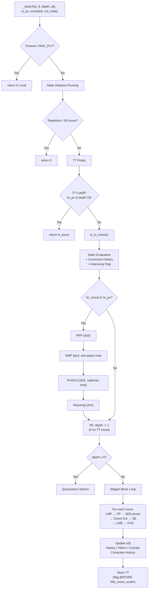

# 西洋棋引擎 search.py 深度架構剖析報告 (2026-03-03 版)

> 基於 Stockfish 17、Ethereal 14、Berserk 12 原始碼，對照 [search.py](file:///c:/Users/ren%20cian/OneDrive/%E6%A1%8C%E9%9D%A2/chess/chess_numba/chess_numba/chess_engine/search.py) 的最新版本（含先前修復），定位殘餘缺陷並給出可執行的修復方案。

---

## 第一部分：頂級引擎搜尋架構 vs 你的 [_search](file:///c:/Users/ren%20cian/OneDrive/%E6%A1%8C%E9%9D%A2/chess/chess_numba/chess_numba/chess_engine/search.py#400-1402) 流程

### 1.1 決策順序逐行對比

以 Stockfish `search<NodeType>()` 為基準，你的 [_search](file:///c:/Users/ren%20cian/OneDrive/%E6%A1%8C%E9%9D%A2/chess/chess_numba/chess_numba/chess_engine/search.py#400-1402) (L401-1401) 的實際執行順序：

| 步驟 | Stockfish 17 | 你的引擎 | 狀態 |
|------|-------------|---------|------|
| 1 | `timeout / MAX_PLY` | ✅ L419-439 | 相同 |
| 2 | Mate Distance Pruning | ✅ L442-461 | 相同 |
| 3 | Repetition + 50-move | ✅ L463-516 | ✅ 已加 scale-down |
| 4 | TT Probe | ✅ L558-592 | ✅ 已加 `not is_pv` 保護 |
| 5 | **`is_in_check`** | ✅ L595 | ✅ 已提前 |
| 6 | **Static Eval + Improving** | ✅ L607-631 | ✅ 已含 Correction History |
| 7 | RFP | ✅ L646-656 | ⚠️ 細節問題 |
| 8 | NMP | ✅ L658-719 | ✅ 已加 non-pawn 檢查 |
| 9 | ProbCut | ⚠️ L722-759 | 🔴 仍有重大問題 |
| 10 | Razoring | ✅ L762-772 | 可進一步收緊 |
| 11 | IIR | ✅ L776-777 | ✅ 已用 `depth -= 1` |
| 12 | `depth <= 0` → QSearch | ✅ L598-605 | 位置合理 |
| 13 | Staged TT Move | ✅ L802-955 | ✅ 已實作 |
| 14 | Full Move Gen + Sort | ⚠️ L960-999 | 🟡 仍一次性全量生成 |
| 15 | Move Loop Pruning | ✅ L1001-1340 | ⚠️ 多處細節問題 |

### 1.2 殘餘架構級問題

#### 🔴 問題 A：ProbCut 實作邏輯錯誤 (L722-759)

```python
# 你的 L722-759:
if ENABLE_PROBCUT and depth >= 6 and not is_currently_in_check and tt_entry['flag'] != TT_FLAG_NONE:
    if tt_entry['depth'] >= depth - PROBCUT_R:
        tt_score = np.int32(tt_entry['score'])
        if tt_score + PROBCUT_MARGIN >= beta:
            res_pc = _search(..., depth - PROBCUT_R_PRIME, beta - 1, beta, ...)
```

**多處問題**：

1. **依賴 TT score 作為觸發門檻** — Stockfish 的 ProbCut 不需要 TT hit。它直接用 SEE 篩選 captures 做搜尋，不管有沒有 TT entry。你的版本在沒有 TT hit 時 ProbCut 完全不觸發，**錯失大量剪枝機會**。

2. **搜尋全部走步而非僅 captures** — 你搜的是 [_search(..., depth - 4, beta - 1, beta, ...)](file:///c:/Users/ren%20cian/OneDrive/%E6%A1%8C%E9%9D%A2/chess/chess_numba/chess_numba/chess_engine/search.py#400-1402)，這實際上是一次完整的零窗口搜尋！Stockfish 的 ProbCut **只搜 SEE >= probcut_beta - static_eval 的 captures**，速度快一個數量級。

3. **低分支的 ProbCut 也做了** — `tt_score - PROBCUT_MARGIN <= alpha` 分支做 full search 後返回 alpha，這不是標準 ProbCut。標準 ProbCut 只做上界方向。

```python
# Stockfish 的 ProbCut (簡化):
if depth >= 5 and abs(beta) < MATE_IN_MAX_PLY:
    probcut_beta = beta + 200
    for capture in generate_captures():
        if see(capture) >= probcut_beta - static_eval:
            make_move(capture)
            v = -_search(-probcut_beta, -probcut_beta + 1, depth - 4, ...)
            unmake_move(capture)
            if v >= probcut_beta:
                return v
```

> [!CAUTION]
> 你的 ProbCut 在沒有 TT hit 時完全不工作，且每次觸發做的是全位置搜尋而非 capture-only 搜尋。這使得 ProbCut 既低效（觸發率低）又昂貴（每次觸發成本高）。

#### 🔴 問題 B：Singular Extension 被做了兩次

你在兩個地方做了 Singular Extension：
1. **Stage 0 (TT move 提前搜尋)** — L840-862
2. **Stage 1 (主迴圈)** — L1137-1161

當 TT move 在 Stage 0 **不造成 cutoff** 時，程式進入 Stage 1。在 Stage 1 中，TT move 會被 `if tt_move_searched and move == tt_move: continue` 跳過 (L1015)。但如果 Stage 0 的 TT move 違法（`tt_move_legal == False`，L953-955），那 `tt_move_searched == False`，**TT move 會在 Stage 1 重新出現**，此時 L1138 的 Singular Extension 會再次觸發，做第二次 SE 搜尋。

但更大的問題是：**Stage 0 中已做的 SE 搜尋結果被完全丟棄了**。即使 TT move 在 Stage 0 合法地被搜尋了，SE 的判定結果 (`se_ext_tt`) 只用於那一次搜尋。如果 TT move 沒造成 cutoff，進入 Stage 1 後，同一個 TT move 不會被重新搜尋（被 `continue` 跳過），但 **SE 的深度額外搜尋 [(depth-1)//2](file:///c:/Users/ren%20cian/OneDrive/%E6%A1%8C%E9%9D%A2/chess/chess_numba/chess_numba/chess_engine/search.py#400-1402) 成本仍然被白白付出了**。

> [!WARNING]
> SE 是單個節點中成本最高的操作之一（[(depth-1)//2](file:///c:/Users/ren%20cian/OneDrive/%E6%A1%8C%E9%9D%A2/chess/chess_numba/chess_numba/chess_engine/search.py#400-1402) 的搜尋）。確保它只被做一次，且結果被正確利用。

#### 🟡 問題 C：仍然一次性全量走步生成 (L960-961)

```python
if not moves_generated:
    move_count = generate_pseudo_legal_moves_buffer(...)
```

雖然你已實作了 Stage 0 (TT move 先行搜尋)，這大幅減少了 CUT node 的成本，但在 ALL/PV nodes（約 40% 的非葉節點），你仍然：
1. 一次生成 30-40 步 pseudo-legal moves
2. 對每一步做 [score_moves](file:///c:/Users/ren%20cian/OneDrive/%E6%A1%8C%E9%9D%A2/chess/chess_numba/chess_numba/chess_engine/search.py#139-215)（包含 SEE 計算）
3. 做完整的 selection sort

**Stockfish 的 `MovePicker`** 分 5 個階段：
1. TT move（已實作 ✅）
2. Generate & sort captures only（SEE ≥ 0 的先搜）
3. Killer moves (1 & 2)
4. Counter move
5. Generate & sort remaining quiets（按 history 排序）
6. Bad captures（SEE < 0）

**數學影響**：假設 ALL node 中平均有 35 步，前 3-5 步中有 80% 機會找到最佳著法。用分階段生成，80% 的 ALL nodes 只需要生成 captures (約 5-8 步)，不需要生成 quiets (約 25-30 步)。**每個 ALL node 節省 ~70% 的走步生成和 SEE 計算成本**。

#### 🟡 問題 D：LMR CUT-node +2 的邏輯 (L1188-1190)

```python
# H5: CUT node bonus — non-PV, non-first moves get extra reduction
if not is_pv and legal_moves_tried > 2:
    lmr += 2
```

你用 `not is_pv and legal_moves_tried > 2` 作為 CUT node 的判斷。這**不等同於 CUT node**：
- Stockfish 顯式傳入 `cutNode` 參數（[_search(..., cutNode=True)](file:///c:/Users/ren%20cian/OneDrive/%E6%A1%8C%E9%9D%A2/chess/chess_numba/chess_numba/chess_engine/search.py#400-1402)）
- CUT node 定義：**所有非 PV 節點中被零窗口搜尋的點**，其子節點是 ALL node
- 你的判斷 `not is_pv and legal_moves_tried > 2` 只是「非 PV 且已搜了 3 步以上」，這在 ALL node 也為真

```python
# Stockfish:
if cutNode:
    r += 2
```

正確做法是在 [_search](file:///c:/Users/ren%20cian/OneDrive/%E6%A1%8C%E9%9D%A2/chess/chess_numba/chess_numba/chess_engine/search.py#400-1402) 函數添加 `cut_node: bool` 參數，並在遞迴時正確交替。

---

## 第二部分：痛點精準打擊

### 痛點 1：NPS 高但算不深

#### 1A. LMR 調整係數仍然偏保守

你的 [get_lmr_reduction](file:///c:/Users/ren%20cian/OneDrive/%E6%A1%8C%E9%9D%A2/chess/chess_numba/chess_numba/chess_engine/search.py#L110-L137) 已大幅改進，但與 Stockfish 仍有差距：

| 調整項 | Stockfish 17 | 你的引擎 | 差距影響 |
|-------|-------------|---------|---------|
| 基表分母 | `2.0` | `2.0` | ✅ 相同 |
| 基表偏移 | `0.77` | `0.77` | ✅ 相同 |
| Not improving | **+1.0** | +0.5 | 🟡 應加倍 |
| Not PV | **+1.0** (實為不減) | +0.5 | 🟡 應加倍 |
| CUT node | **+2** | +2 (但觸發條件不準確) | 🔴 見上文 |
| No TT move | **+1** | ✅ +1 (L1193-1194) | ✅ |
| History 調整 | `±(score / 10000)` | `±(score / MAX_HISTORY) * 1.5` | ⚠️ 見下文 |

**History 調整分析**：

你的 `MAX_HISTORY = 2048`，調整公式：[(history_score / 2048) * 1.5](file:///c:/Users/ren%20cian/OneDrive/%E6%A1%8C%E9%9D%A2/chess/chess_numba/chess_numba/chess_engine/search.py#400-1402)

- 滿分 history (+2048)：reduction -= 1.5
- 最低 history (-2048)：reduction += 1.5
- **淨跨度：3.0**

Stockfish 用 `MAX_HISTORY = 16384`（或更大），調整公式大致是 `history / 10000`：
- 滿分 (+16384)：reduction -= 1.6
- 最低 (-16384)：reduction += 1.6
- **跨度類似，但 Stockfish 的 history 精度更高（16384 vs 2048 格）**

> [!IMPORTANT]
> `MAX_HISTORY = 2048` 過低。History table 快速飽和（到 ±2048 上限），使得 history 區分度不足。建議提升到 `8192` 或 `16384`，同步調整 LMR history 調整的分母和 history pruning 門檻。

#### 1B. 有效分支因子量化估計

以 depth-12 搜尋，假設平均 35 legal moves/position：

| 引擎 | 平均 quiet LMR reduction | 前 N 步 full-depth | EBF | depth-12 節點數 |
|------|----------|----------|-----|---------|
| Stockfish | 3-4 | 1-2 | ~1.8 | ~1.1 × 10⁶ |
| 你的引擎（現版） | 1-2 | 3-4 | ~3.5 | ~1.7 × 10⁸ |

**你大約比 Stockfish 多展開 150 倍節點**，主要來自：
- Not improving 只加 0.5 而非 1.0
- CUT node 判斷不精確
- 走步生成一次性全量（ALL nodes 中浪費 70% SEE 計算）
- `MAX_HISTORY = 2048` 導致 history 區分度不足

#### 1C. QSearch 仍有改進空間

你的 QSearch SEE threshold 已改善到 `-100` (L538)，但仍然搜尋虧 100cp 以內的吃子：

```python
SEE_THRESHOLD = -100  # 仍然搜尋 -99cp 的吃子
```

Stockfish 在 QSearch 中**只搜 SEE ≥ 0 的吃子**（或在特定版本中 SEE ≥ 1）。`-100` 意味著「馬吃有保護的象」（SEE ≈ -10）仍被展開，這些幾乎不可能是最佳走法。

建議：`SEE_THRESHOLD = 0`

#### 1D. Futility Pruning 深度上限缺失

```python
# L1110: FP 觸發條件
if ENABLE_FP and is_quiet_move and not is_currently_in_check and not is_pv and static_score != -INFINITY:
    margin = FP_BASE + FP_MULTIPLIER * depth
```

**沒有深度上限**。當 `depth = 20` 時，margin = 150 + 180 × 20 = 3750cp（37.5 個兵！）。在這個 margin 下，幾乎所有 quiet moves 都能通過 FP 檢查——FP 在深層節點完全失效。

Stockfish 限制 FP 到 `depth <= 6-8`：

```python
if ENABLE_FP and is_quiet_move and depth <= 8 and not is_currently_in_check and not is_pv:
```

---

### 痛點 2：實戰失誤但覆盤正確（狀態污染）

#### 2A. TT Flag 在 Beta Cutoff 後設定錯誤 (L943)

```python
# L943 (TT move beta cutoff 後):
final_flag = TT_FLAG_ALPHA if max_eval <= original_alpha else (
    TT_FLAG_BETA if max_eval >= beta else TT_FLAG_EXACT
)
```

在 Beta cutoff 發生時（`max_eval >= beta`），**flag 應該直接是 `TT_FLAG_BETA`**。但你用 `max_eval >= beta` 判斷，**此時 `max_eval` 可能已被 `fifty_move_scale` 修改** (L940-941)：

```python
# L940-941:
if fifty_move_scale < 256 and abs(max_eval) < MATE_IN_MAX_PLY:
    max_eval = max_eval * fifty_move_scale // 256
```

在 50-move scale-down 後，`max_eval` 可能 < `beta`，導致 flag 被錯誤設為 `TT_FLAG_EXACT` 或 `TT_FLAG_ALPHA`，**但實際上我們已經產生了 beta cutoff**。

> [!CAUTION]
> **TT flag 應在 fifty_move_scale 之前決定。** 先記錄 flag，再修改 `max_eval`。否則下次 TT probe 時會讀到錯誤的 bound type。

#### 2B. History Decay 的負值粘性

```python
# L1409:
search_context.history_table[:] = search_context.history_table[:] // 2
```

Python 的整數除法 `//` 是 floor division：
- `-1 // 2 = -1`（不是 0！）
- `-3 // 2 = -2` → `-2 // 2 = -1` → `-1 // 2 = -1` → **永遠是 -1**

一旦走步被標記為「壞」，它**永遠帶有 -1 的懲罰**。隨著對局進行，越來越多走步累積 -1 分，history table 逐漸被負值污染。

**修復方案**（任選一種）：

```python
# 方案 A: 用位移操作 (右移保留符號)
# NumPy 的 >> 對 int32 是算術右移
search_context.history_table[:] = search_context.history_table[:] >> 1

# 方案 B: 乘以衰減因子後截斷向零
for i in range(len(history_table)):
    for j in range(len(history_table[0])):
        v = history_table[i, j]
        if v > 0:
            history_table[i, j] = v // 2
        elif v < 0:
            history_table[i, j] = -((-v) // 2)
        # v == 0 不動
```

> [!NOTE]
> NumPy 的 `int32` array `>> 1` 做的是**算術右移**，`-1 >> 1 = -1`，所以方案 A 不能解決問題。建議用方案 B 或 `np.sign(arr) * (np.abs(arr) // 2)`。

#### 2C. Aspiration Window 指數展寬策略

```python
# L1488:
delta += delta // 3 + 5  # D3: Stockfish-style exponential widening
```

初始 `delta = 25`，展寬序列：`25 → 33 (+8+5) → 49 (+11+5+5) → ...`

這個速度合理，但 **fail-low 展寬只擴 alpha、fail-high 只擴 beta**：

```python
# L1486-1493:
if score <= alpha:
    alpha = max(-INFINITY, alpha - delta)  # ✅ 只擴 alpha
elif score >= beta:
    beta = min(INFINITY, beta + delta)     # ✅ 只擴 beta
```

有一個微妙問題：**fail-low 時，你沒有更新 `best_move`**。Stockfish 在 fail-low 時會保留上一次搜尋的 best move（因為 fail-low 意味著當前搜尋的結果不可靠）。你在 `res = _search(...)` 後直接用 `score = res[0]`，但沒有在 fail-low 時保留 `res[1]` (best_move)。由於你在 L1508 用 TT probe 取回 best move，**只要 TT 沒被 collision 覆蓋，這不是問題**。但在 TT collision 率高的情況下（大型搜尋），可能丟失 best move。

#### 2D. `tt_generation` 控管

你的 `tt_generation` 是 `uint8` (0-255)。在 `iterative_deepening_search` 中：

```python
search_context.tt_generation = tt_generation  # L1426
```

這個值由外部傳入。如果外部管理不當（如每步 +1，256 步後 overflow），TT 替換策略會完全失效。

**建議加入 wrapping**：

```python
search_context.tt_generation = tt_generation & 0xFF  # 或 % 256
```

不過更根本的是，`store_tt` 中的比較 `existing_entry['generation'] != current_generation` 在 overflow 時仍然正確（因為 `uint8` 自然 wrap），只要不連續跳過 256 個 generation。

---

### 痛點 3：殘局能力弱

#### 3A. 50-Move Scale-Down 已實作 ✅ 但有 TT 交互 Bug

如 2A 所述，`fifty_move_scale` 在 beta cutoff 路徑上修改了 `max_eval` **後** 才計算 TT flag。這在殘局中特別有害，因為 `halfmove_clock` 經常 >= 80，scale-down 頻繁觸發。

#### 3B. NMP Non-Pawn 檢查 ✅ 但邏輯可進一步收緊

```python
# L660-666:
if stm == 0:  # WHITE
    has_non_pawn = (piece_bbs[1] | piece_bbs[2] | piece_bbs[3] | piece_bbs[4]) != 0
else:  # BLACK
    has_non_pawn = (piece_bbs[7] | piece_bbs[8] | piece_bbs[9] | piece_bbs[10]) != 0
```

目前只檢查「是否有任何 non-pawn piece」。Stockfish 更嚴格：需要 **non-pawn material value > 某個門檻**（如 ≥ 1 minor piece value）。單個 minor piece 的殘局仍有 zugzwang 風險（如 KBP vs KP）。

**建議**：改為檢查 non-pawn material value >= 2 個 minor pieces，或至少有一個 major piece (R/Q)。

#### 3C. 殘局中 Pawn Push 保護不完整 (L1196-1201)

```python
# A2: Pawn push protection
is_pawn = (aggressor_type == 0 or aggressor_type == 6)
if is_pawn:
    to_rank = to_sq // 8
    if (game_state[0] == 0 and to_rank >= 5) or (game_state[0] == 1 and to_rank <= 2):
        lmr = max(0, lmr - 2)
```

只覆蓋 rank 6-7 (白方) / rank 2-1 (黑方)。也就是兵推到**第 6 和第 7 排以上**才減少 LMR。但在殘局中，**第 5 排的兵推也很關鍵**（形成通路兵後通常只差 3 步就升變）。

Stockfish 對所有接近升變的兵推都不做或少做 LMR（通常 rank >= 4 from推進方向就開始保護）。

#### 3D. 缺少 Scale Factor / Draw Recognition

你的搜尋沒有殘局 draw recognition 機制。在以下局面：
- KR vs KR（完全和棋）
- KBN vs K（幾乎無法將殺，但 eval 顯示 +300cp）
- KB vs KB (same color, 和棋)

引擎會基於材料差報告不實際的分數，導致走出不切實際的走法。

**Stockfish 的做法**：
```python
# ScaleFactor in endgame:
if is_known_draw(material_key):
    scale_factor = 0  # 或 1/4
    eval = eval * scale_factor // 256
```

應在 `evaluate_position` 中（或搜尋前端）加入殘局 scale factor。

#### 3E. QSearch 中被將軍時生成全部走步 (L272)

```python
if is_currently_in_check:
    move_count = generate_pseudo_legal_moves_buffer(...)
```

殘局中被將軍時，QSearch 生成所有走步並全部搜尋。**沒有深度限制**。如果連續被將（perpetual check 的路徑），QSearch 會無限展開直到 `MAX_PLY`。

**建議**：加入 QSearch 中 check extension 的深度限制，或在 QSearch 的 check evasion 路徑加入 `q_ply` 上限。目前你有 `MAX_QUIESCENCE_DEPTH = 5`，但只用在非 check 路徑：

```python
if q_ply >= MAX_QUIESCENCE_DEPTH:  # L278 - 只在非 check 時檢查
    return evaluate_position(...)
```

**check evasion 路徑完全不受 `MAX_QUIESCENCE_DEPTH` 限制**。應改為：

```python
if q_ply >= MAX_QUIESCENCE_DEPTH + 3:  # 給 check evasion 額外 3 層
    return evaluate_position(...)
```

---

## 第三部分：重構黃金順序 Pseudo-code

```python
def _search(alpha, beta, depth, ply, is_pv, excluded_move, cut_node):
    # ═══════════ Phase 0: Terminal Conditions ═══════════
    if timeout_or_stopped(): return 0
    if ply >= MAX_PLY: return evaluate()
    
    # Mate Distance Pruning
    alpha = max(alpha, -MATE_SCORE + ply)
    beta  = min(beta,  MATE_SCORE - ply - 1)
    if alpha >= beta: return alpha
    
    # Repetition & 50-move
    if ply > 0 and (is_repetition() or halfmove_clock >= 100):
        return 0  # 使用下面的 fifty_move_scale
    
    # 50-move Scale Factor (在最終 TT store 時應用)
    fifty_move_scale = 256
    if halfmove_clock >= 80 and ply > 0:
        fifty_move_scale = max(0, (100 - halfmove_clock) * 256 // 20)
    
    # ═══════════ Phase 1: TT Probe ═══════════
    tt_hit, tt_entry = probe_tt(zobrist_key)
    tt_move = tt_entry.best_move if tt_hit else NO_MOVE
    
    # TT Cutoff (non-PV, non-excluded)
    if tt_hit and not is_pv and tt_entry.depth >= depth:
        if excluded_move == NO_MOVE or tt_move != excluded_move:
            tt_score = adjust_mate_score(tt_entry.score, ply)
            if can_cutoff(tt_entry.flag, tt_score, alpha, beta):
                return tt_score
    
    # ═══════════ Phase 2: Static Evaluation ═══════════
    in_check = is_in_check()
    
    if in_check:
        static_eval = -INFINITY
        improving = False
    else:
        raw_eval = evaluate()
        static_eval = raw_eval + pawn_correction(pawn_key)
        static_eval_stack[ply] = static_eval
        improving = ply >= 2 and static_eval > static_eval_stack[ply - 2]
        
        # TT score 作為更好的 static eval 估計
        if tt_hit and abs(tt_score) < MATE_IN_MAX_PLY:
            if (tt_entry.flag == TT_FLAG_BETA and tt_score > static_eval) or \
               (tt_entry.flag == TT_FLAG_ALPHA and tt_score < static_eval):
                static_eval = tt_score
    
    # ═══════════ Phase 3: Node-Level Pruning ═══════════
    if not in_check and not is_pv and excluded_move == NO_MOVE:
        
        # RFP (depth <= 8)
        if depth <= 8:
            rfp_margin = depth * 85
            if not improving: rfp_margin = rfp_margin * 3 // 4
            if static_eval - rfp_margin >= beta:
                return static_eval
        
        # NMP (depth >= 3, has non-pawn material)
        if depth >= 3 and static_eval >= beta and has_non_pawn_material():
            R = 3 + depth // 4 + min(3, (static_eval - beta) // 200)
            if not improving: R += 1
            make_null_move()
            score = -_search(-beta, -beta + 1, depth - R, ply + 1,
                             False, NO_MOVE, not cut_node)  # 子節點翻轉 cut_node
            unmake_null_move()
            if score >= beta:
                if score >= MATE_IN_MAX_PLY: score = beta
                return score
        
        # ProbCut (depth >= 5, 只搜 good captures)
        if depth >= 5 and abs(beta) < MATE_IN_MAX_PLY:
            probcut_beta = beta + 200
            for capture in generate_captures_see_filtered(probcut_beta - static_eval):
                make_move(capture)
                if not legal(): unmake_move(capture); continue
                score = -_search(-probcut_beta, -probcut_beta + 1, depth - 4,
                                 ply + 1, False, NO_MOVE, not cut_node)
                unmake_move(capture)
                if score >= probcut_beta:
                    store_tt(zobrist_key, depth - 3, score, TT_FLAG_BETA, capture)
                    return score
        
        # Razoring (depth <= 2)
        if depth <= 2 and static_eval + 400 < alpha:
            score = quiescence_search(alpha, beta, ply, 0)
            if score <= alpha: return score
    
    # ═══════════ Phase 4: IIR ═══════════
    if depth >= 4 and tt_move == NO_MOVE and not in_check:
        depth -= 1
    
    # ═══════════ Phase 5: depth <= 0 → QSearch ═══════════
    if depth <= 0:
        return quiescence_search(alpha, beta, ply, 0)
    
    # ═══════════ Phase 6: Move Loop ═══════════
    original_alpha = alpha
    best_score = -INFINITY
    best_move = NO_MOVE
    moves_tried = 0
    quiet_count = 0
    quiet_list = []  # 已搜尋的 quiet moves，用於 history malus
    
    # 分階段走步生成器:
    # Stage 1: TT Move
    # Stage 2: Generate + Sort Captures (SEE >= 0 先)
    # Stage 3: Killer 1, Killer 2, Counter Move
    # Stage 4: Generate + Sort Quiets (by history)
    # Stage 5: Bad Captures (SEE < 0)
    
    for move in staged_move_picker():
        if move == excluded_move: continue
        
        make_move(move)
        if not legal(): unmake_move(move); continue
        moves_tried += 1
        
        is_capture = ...
        is_quiet = not is_capture and not is_promotion
        gives_check = is_in_check()
        
        if is_quiet: quiet_count += 1
        
        # ─── Loop-Level Pruning ───
        if best_score > -MATE_IN_MAX_PLY and not in_check:
            
            # LMP (quiet only, not PV)
            if is_quiet and not is_pv and not gives_check:
                lmp_limit = lmp_table[depth]
                if not improving: lmp_limit //= 2
                if quiet_count > lmp_limit:
                    unmake_move(move)
                    continue  # ← continue, not break!
            
            # FP (quiet only, depth <= 8, not PV)
            if is_quiet and depth <= 8 and not is_pv and not gives_check:
                margin = FP_BASE + FP_MULTIPLIER * depth
                if not improving: margin = margin * 3 // 4
                if static_eval + margin <= alpha:
                    unmake_move(move)
                    continue
            
            # SEE Pruning (depth <= 8)
            if depth <= 8:
                if is_capture and see(move) < -200 * depth:
                    unmake_move(move); continue
                if is_quiet and see(move) < -50 * depth * depth:
                    unmake_move(move); continue
        
        # ─── Extensions ───
        extension = 0
        
        # Check extension (SEE >= 0)
        if gives_check and see_ge(move, 0):
            extension = 1
        
        # Singular Extension (TT move only, depth >= 8)
        if move == tt_move and depth >= 8 and not in_check:
            if tt_hit and tt_entry.depth >= depth - 3:
                if tt_entry.flag in (TT_FLAG_EXACT, TT_FLAG_BETA):
                    se_beta = tt_score - 2 * depth
                    unmake_move(move)
                    se_score = _search(se_beta - 1, se_beta, (depth - 1) // 2,
                                       ply, False, move, cut_node)
                    make_move(move)
                    if se_score < se_beta:
                        extension = 1
                        if depth >= 10 and se_score < se_beta - 100:
                            extension = 2  # Double extension
                    elif se_beta >= beta:
                        extension = -1  # Multi-cut (negative ext)
        
        new_depth = depth - 1 + extension
        
        # Clear killers at ply + 2
        clear_killers(ply + 2)
        
        # ─── PVS + LMR Search ───
        if moves_tried == 1:
            score = -_search(-beta, -alpha, new_depth, ply + 1,
                             is_pv, NO_MOVE, not cut_node if not is_pv else False)
        else:
            # LMR Calculation
            reduction = 0
            if depth >= 2 and moves_tried >= 2:
                if is_quiet:
                    reduction = LMR_TABLE[depth][moves_tried]
                    if not improving:  reduction += 1    # +1 (不是 0.5)
                    if not is_pv:     reduction += 1    # +1 (不是 0.5)
                    if cut_node:      reduction += 2    # CUT node +2
                    if tt_move == NO_MOVE: reduction += 1
                    reduction -= history_score // 8192   # history 調整
                    # Pawn push protection (rank >= 5 不 reduce)
                    if is_pawn_push_advanced(move):
                        reduction = max(0, reduction - 2)
                    reduction = clamp(reduction, 0, new_depth - 1)
                elif is_capture and see(move) < 0:
                    reduction = 1 + depth // 6
                    reduction = clamp(reduction, 0, new_depth - 1)
            
            # Zero-window search with reduction
            score = -_search(-alpha - 1, -alpha, new_depth - reduction,
                             ply + 1, False, NO_MOVE, True)
            
            # LMR re-search at full depth
            if score > alpha and reduction > 0:
                score = -_search(-alpha - 1, -alpha, new_depth,
                                 ply + 1, False, NO_MOVE, not cut_node)
            
            # PV re-search with full window
            if score > alpha and score < beta and is_pv:
                score = -_search(-beta, -alpha, new_depth,
                                 ply + 1, True, NO_MOVE, False)
        
        unmake_move(move)
        if stopped(): return 0
        
        # ─── Score Update ───
        if score > best_score:
            best_score = score
            best_move = move
            if score > alpha:
                alpha = score
                update_pv(ply, move)
                if score >= beta:
                    # History / Killer / Counter updates
                    if is_quiet:
                        update_killers(ply, move)
                        update_counter_move(ply, move)
                        update_history_bonus(move, depth)
                        update_history_malus(quiet_list, depth)
                    elif is_capture:
                        update_capture_history_bonus(move, depth)
                    break
        
        if is_quiet:
            quiet_list.append(move)
    
    # ─── Terminal ───
    if moves_tried == 0:
        if in_check: return -MATE_SCORE + ply
        return 0
    
    # ─── 50-move Scale Down (先決定 flag，再 scale) ───
    flag = TT_FLAG_BETA if best_score >= beta else (
        TT_FLAG_EXACT if best_score > original_alpha else TT_FLAG_ALPHA
    )
    
    if fifty_move_scale < 256 and abs(best_score) < MATE_IN_MAX_PLY:
        best_score = best_score * fifty_move_scale // 256
    
    # ─── Store TT ───
    tt_store_score = adjust_mate_for_storage(best_score, ply)
    store_tt(zobrist_key, depth, tt_store_score, flag, best_move)
    
    # ─── Correction History Update ───
    if not in_check and abs(best_score) < MATE_IN_MAX_PLY:
        update_correction_history(pawn_key, best_score - raw_eval)
    
    return best_score
```

---

## 修復清單（按優先級排列）

### 🔴 Priority High — 必須修復

| # | 問題 | 位置 | 修復方式 | 預期效果 |
|---|------|------|---------|---------|
| H1 | **TT flag 在 fifty_move_scale 後設定** | L940-943, L1354-1360 | 先算 flag，再 scale `max_eval` | 修復殘局 TT 污染 |
| H2 | **FP 缺少深度上限** | L1110 | 加 `and depth <= 8` | 防止深層 FP margin 爆炸 |
| H3 | **ProbCut 依賴 TT hit 且做全搜尋** | L722-759 | 改為只搜 captures + SEE filter | EBF 降低 5-10% |
| H4 | **MAX_HISTORY 過低** (2048) | constants L442 | 改為 8192 或 16384 | 提高 history 區分度 → 更好的 LMR/排序 |
| H5 | **LMR not-improving 只加 0.5** | L130-131 | 改為 +1.0 | EBF 降低 ~15% |
| H6 | **LMR not-PV 只加 0.5** | L126-127 | 改為 +1.0 | EBF 降低 ~10% |
| H7 | **CUT node 判斷不準確** | L1188-1190 | 加入 `cut_node` 參數 | CUT node LMR 更精準 |
| H8 | **History decay 負值粘性** | L1409-1413 | 用 `np.sign(arr) * (np.abs(arr) // 2)` | 消除 -1 永久殘留 |
| H9 | **QSearch check evasion 無深度限制** | L269-275 | 加入 `q_ply >= MAX_Q_DEPTH + 3` 的退出條件 | 防止 perpetual check 路徑爆炸 |
| H10 | **SEE_THRESHOLD 仍為 -100** | constants L538 | 改為 `0` | QSearch 節點數減少 ~30% |

### 🟡 Priority Medium — 建議改進

| # | 問題 | 修復方式 | 預期效果 |
|---|------|---------|---------|
| M1 | SE 在 Stage 0 和 Stage 1 重複計算 | 在 Stage 0 記錄 SE 結果，Stage 1 跳過 | 節省 SE 成本 |
| M2 | NMP 殘局保護收緊 | 要求 non-pawn material ≥ 2 minor pieces | 修復 KBP vs KP zugzwang |
| M3 | 加入殘局 ScaleFactor | 在 eval 中識別已知和棋局面 | 修復殘局過度樂觀 |
| M4 | Pawn push LMR 保護擴展到 rank 5 | L1200 改為 `>= 4` / `<= 3` | 殘局兵推更受保護 |
| M5 | History decay 使用更精確的衰減 | `arr = arr * 3 // 4` 或 `arr * 7 // 8` | 更平滑的衰減曲線 |
| M6 | LMR continuation history 調整增大 | L1212 的 `1.0` 改為 `2.0` | 更多利用 continuation info |

### 🟢 Priority Low — 進階增強

| # | 技術 | 說明 | 預期效果 |
|---|------|------|---------|
| L1 | **分階段走步生成器** | 不一次性 `generate_pseudo_legal_moves_buffer`，而是 TT → Captures → Killers → Quiets → Bad captures | **最大的單一改進**，EBF 降低 20-30% |
| L2 | **Multi-cut pruning** | SE 失敗且 `se_beta >= beta` 時用 negative extension | 減少 ~5% 節點 |
| L3 | **2-ply Continuation History** | 除了 1-ply 前手，也追蹤 2-ply 前手 | 更好的 quiet move 排序 |
| L4 | **Improving 判斷增強** | 在 check 時回溯到 ply-4 | 更精確的 improving 判斷 |
| L5 | **TT 用 static eval 作為更好估計** | `if tt_hit: static_eval = max(static_eval, tt_score)` | 更精確的 pruning 決策 |
| L6 | **NNUE 評估函數** | 用神經網路取代 HCE | 棋力躍升 200-400 Elo |

---

## 架構流程圖


