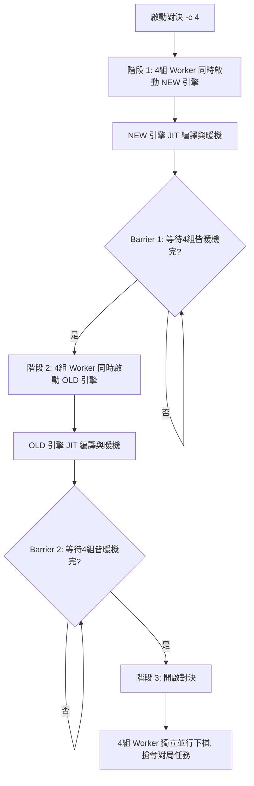

# 🏆 引擎對戰與聯賽指南 (Tournament & Match Tutorial)

本指南將引導您如何使用 [tournament.py](file:///c:/Users/ren%20cian/OneDrive/%E6%A1%8C%E9%9D%A2/chess/chess_numba/chess_numba/tools/tournament.py) 腳本，在多核心環境下對您的西洋棋引擎進行自動對決、統計評估與棋力增長驗證。

---

## 📌 快速概覽與核心觀念

引擎對戰是西洋棋引擎開發中最重要的驗證手段。本專案整合了 **SPRT (序貫概率比檢定)**，能用最少的對局數判斷修改後的代碼（NEW）是否相較於舊版本（OLD）有顯著的棋力提升，避免盲目調參。

> [!IMPORTANT]
> **首次編譯警告**：本引擎的核心搜尋與評估函數採用了 **Numba JIT** 進行靜態編譯。在沒有快取的情況下，首次導入與編譯引擎需要約 **3 至 5 分鐘**。此時程式看起來會停住不動，這是 Numba 正在編譯 LLVM 機器碼，請耐心等候。

---

## ⚙️ 參數設定與命令列參數

您可以在工作區根目錄下，透過命令列參數自訂對戰：

```bash
python tools/tournament.py [參數]
```

### 1. 核心參數列表

| 參數 | 預設值 | 說明 |
| :--- | :--- | :--- |
| `--games` | `100` | 總對局場數。注意：必須是偶數（因為會自動成對對局，先後手互換）。 |
| `--time` | `1000` | 每步考慮時間，單位為毫秒（ms）。 |
| `--depth` | `None` | 固定搜尋深度（會覆蓋時間限制，適用於深度基準測試）。 |
| `--nodes` | `None` | 固定節點數限制（會覆蓋時間與深度限制）。 |
| `-c`, `--concurrency` | `1` | 並行對戰的 Worker 數量。**若想加快對決速度並跑滿 CPU，請設為您的 CPU 核心數（例如 `-c 4`）。** |
| `--clear-cache` | `False` | 啟動前強制清空 Numba 的 JIT 快取。 |
| `--engine1` | `main.py` | NEW 引擎進入點路徑。 |
| `--engine2` | `main_old.py` | OLD 引擎進入點路徑。 |
| `--name1` | `New` | NEW 引擎在 PGN 棋譜中的名字。 |
| `--name2` | `Old` | OLD 引擎在 PGN 棋譜中的名字。 |

---

## ⚡ 併發對戰與雙重屏障同步機制 (Barrier Synchronization)

當您設定並行對決（例如 `-c 4`）時，系統會開啟 4 組 worker 同時對戰。為了防止多個 Worker 同時編譯時產生 **Numba 快取鎖定衝突（Lock Collision）**，系統內建了**雙重屏障（Double Barrier）**同步機制：



### 屏障機制的 Terminal 輸出行為
在進行雙重屏障同步時，控制台會顯示如下資訊：
1. **[New warmup]**：4 個 Worker 同時在背景編譯 NEW 引擎。只有 `worker_0` 的詳細暖機過程（深度的評估與搜尋結果）會即時印出，直到印出 `bestmove ...`，等待其他 3 個 Worker 也編譯就緒。
2. **[Old init/warmup]**：NEW 引擎全部就緒後，開始編譯 OLD 引擎。同樣只有 `worker_0` 會印出暖機細節，直到印出 `bestmove ...`。
3. **對決開啟**：所有 Worker 進入並行對決，搶奪任務，速度飛快。

---

## 📊 控制台輸出與結果解讀

### 1. 對局結果輸出

對戰開始後，為了避免多線程同時輸出導致畫面被撕裂，Terminal 輸出採用以下規則：
* **第 1 組對局（Game 1 & 2）**：會**即時滾動印出每一步的走法**，方便您觀察引擎實時的運算動態。
* **其他所有組局**：在對局進行中不會有任何輸出。直到該對局**下完的瞬間**，才會以**整包日誌**的形式一口氣印在畫面上。
* **統計資訊**：每當有任一場對局結束，畫面上都會刷新全局統計：

```text
After 10 pairs (20 games):
New: 12.5
Old: 7.5
SPRT LLR: 1.25 bounds: [-2.94, 2.94]
SPRT Status: Continue
------------------------------
```

### 2. SPRT 提早終止機制

SPRT (Sequential Probability Ratio Test) 會根據當前累積的比分計算出 **LLR (對數概度比)**。
* 若 LLR 觸及上限 `2.94`（代表 NEW 顯著優於 OLD），對決會**提早結束**並宣告 NEW 引擎棋力上升（Accept H1）。
* 若 LLR 觸及下限 `-2.94`（代表 NEW 沒有顯著進步），對決也會**提早結束**（Accept H0）。
* 這就是為什麼設定 `--games 100`，但有時在第 20 場或 30 場就突然停住並顯示結果的原因，此機制能節省大量的 CPU 測試時間。

---

## 💾 檢視對局棋譜 (PGN) 與步步搜尋分析

所有對局的詳細棋譜會自動覆寫並追加記錄在：
[tournament_results.pgn](file:///c:/Users/ren%20cian/OneDrive/%E6%A1%8C%E9%9D%A2/chess/chess_numba/chess_numba/tournament_analysis/tournament_results.pgn)

### 📊 每步棋最大深度詳細資料記錄
新版對戰工具會**自動截取並解析每一步在最大搜尋深度時的詳細搜尋數據**，並將其作為 PGN 標準註解（Comment）寫入棋譜中。
例如在 PGN 棋譜內，您會看到如下格式：
`1. e4 {d=12, eval=+0.25, n=4521, t=240ms} e5 {d=11, eval=-0.15, n=3982, t=198ms}`

* **d**：最大搜尋深度（depth）。
* **eval**：評估分數（如果是 `+0.25` 代表白優，`-0.15` 代表黑優；若是將死則顯示 `#3` 意為 3 步將死）。
* **n**：此步搜尋累積的節點數（nodes）。
* **t**：此步搜尋所耗費的時間（time）。

> [!TIP]
> 1. 這些註解是完全符合標準 PGN 規範的。當您將 `tournament_results.pgn` 載入到 Arena, Cute Chess 或者是 Lichess 時，這些評估數據會以圖表或評估曲線的形式展示出來，非常方便進行搜尋效能與走子質量的分析。
> 2. 由於 concurrency 併發對戰時每個 Worker 的對局時間不同，因此寫入 PGN 的局數順序（Round）可能會是亂序（例如 Round 1, 2, 7, 8...），這在多線程並行中是完全正常的。

---

## 🛠️ 常見問題與排錯 (FAQ)

### Q1. 為什麼畫面一直卡在 `[New warmup]` 或 `[Old warmup]` 的深度 14，且工作管理員看起來沒什麼 CPU 在跑？
* **原因**：Numba 正在進行首次 JIT 編譯，這在有些 CPU 上需要耗費數分鐘的時間。請耐心等候，編譯完後對局就會立刻開始。

### Q2. 為什麼工作管理員只有 2 顆 CPU 在跑，沒有跑滿多核心？
* **原因**：您沒有指定並行參數。預設的 `concurrency` 是 1。請在指令後面加上 `-c 4`（視您的 CPU 核心數而定）來開啟並行。

### Q3. 引擎代碼修改了，但測試結果好像沒有變化，是否使用了舊的編譯快取？
* **原因**：Numba 的快取有時可能未偵測到底層依賴的修改。
* **解法**：請在啟動指令加上 `--clear-cache` 強制清除快取重新編譯：
  ```bash
  python tools/tournament.py -c 4 --clear-cache
  ```
